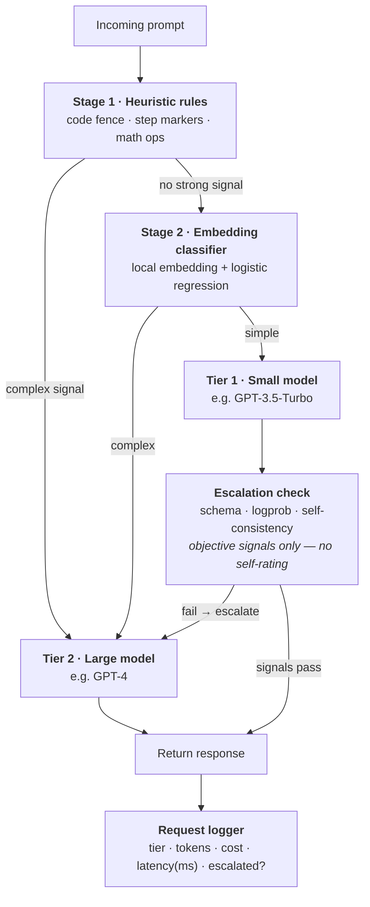

# Cascade Router

**Architecture Design Document**
Two-tier, cost- and latency-aware routing for the LLM Evaluation Platform

| | |
|---|---|
| **Status** | Draft v1 |
| **Owner** | Ghasan |
| **Component** | LLM Evaluation Platform |
| **Scope** | Inference routing & cost pipeline |

## Contents

1. [Problem statement](#1-problem-statement)
2. [Goals & non-goals](#2-goals--non-goals)
3. [System architecture](#3-system-architecture)
4. [Two-stage classification](#4-two-stage-classification)
5. [Cascade escalation](#5-cascade-escalation)
6. [Benchmark comparison strategy](#6-benchmark-comparison-strategy)
7. [Metrics & observability](#7-metrics--observability-pipeline)
8. [Design decisions](#8-design-decisions)
9. [Open questions](#9-open-questions--future-work)
10. [Appendix — log schema](#10-appendix--request-log-schema)
11. [Implementation map](#11-implementation-map)

---

## 1. Problem statement

The evaluation platform's current design queries every configured model — GPT‑4,
GPT‑3.5‑Turbo, and Gemini‑1.5‑Pro — for every prompt. Cost scales as
O(models × prompts), and the majority of those calls go to the most expensive
model even when the prompt does not require its capability.

A naive "cheap model first, then fall back" fix trades cost for a different
problem: if escalation runs after a full cheap-model call and confidence check,
every escalated prompt now pays Latency(small) + Latency(large) sequentially —
worse tail latency than just calling the large model directly. Compounding that,
cheap models are prone to confident hallucination, so asking a small model to
self-report its own confidence is not a reliable escalation signal.

This document specifies a router that addresses both failure modes directly:
routing decisions are made **before** the cheap-model call wherever possible, and
escalation after a cheap-model call is triggered by **objective, externally
observable signals** rather than self-assessment.

## 2. Goals & non-goals

| | Statement |
|---|---|
| **Goal** | Route the majority of prompts to a low-cost model without materially degrading answer quality. |
| **Goal** | Never make an LLM call whose only purpose is deciding whether to make another LLM call. |
| **Goal** | Escalate on objective, measurable signals — schema/format validity, token-level uncertainty, or output disagreement — not self-reported confidence. |
| **Goal** | Report cost savings and latency impact against a real, defensible baseline, not an estimate. |
| **Non-goal** | Guaranteeing the cheap tier never produces a worse answer than the large model would have. The router reduces the rate of that outcome; it does not eliminate it. |
| **Non-goal** | Replacing the platform's existing three-model side-by-side comparison mode. The router is a separate, opt-in path for cost-sensitive usage, not a replacement for explicit multi-model comparison runs. |

## 3. System architecture

Every request passes through up to four decision points before a response is
returned. Two of them — the heuristic rules and the embedding classifier — run
**before any model is called**, so a prompt that is obviously complex (code
generation, multi-step reasoning, math) is sent straight to the large model and
never pays for a cheap-model call it was never going to use. Only prompts that
pass both pre-checks as "simple" go to the small model, and only those are
subject to the post-hoc escalation check.



Heuristics and the embedding classifier run before any model call, so an
obviously complex prompt goes straight to Tier 2 without ever touching Tier 1.
Only ambiguous-but-simple prompts reach the escalation check, which decides on
objective signals — never on the small model's own stated confidence. Every
path, successful or escalated, ends at the same request logger.

## 4. Two-stage classification

Routing decisions are split into two stages specifically so that the fast, free
stage absorbs the clearest cases, and the small paid/latent stage is only
reached for genuinely ambiguous prompts. **Neither stage calls an LLM** — that
constraint is deliberate: a model call made purely to route to another model
call reintroduces the exact latency and cost problem this document exists to
solve.

### Stage 1 — heuristic rules

Cheap, deterministic, sub-millisecond checks applied to the raw prompt text. Any
match short-circuits straight to Tier 2.

| Signal | Example pattern | Routes to |
|---|---|---|
| Code content | Triple-backtick fences, "write a function", language keywords | Tier 2 |
| Multi-step reasoning | "step by step", numbered sub-questions, "first… then…" | Tier 2 |
| Math / formal proof | Operators, "solve", "prove", "calculate" | Tier 2 |
| Long or structurally dense prompt | Token count above threshold, multiple distinct asks in one prompt | Stage 2 |
| None of the above | — | Stage 2 |

### Stage 2 — embedding classifier

For prompts that clear Stage 1 without a strong signal, the prompt is embedded
with a local sentence-embedding model (no network call, ~10–30 ms) and scored by
a lightweight classifier — logistic regression is sufficient — trained on a
labeled set of simple-vs-complex example prompts. The classifier's only job is a
binary route decision; it is retrained periodically as usage patterns drift, and
its cold-start requirement (roughly 200–500 labeled examples before it's
trustworthy) is tracked as an open item below.

> **Constraint carried through both stages:** the pre-query path never makes a
> network call to an LLM provider. If it did, the router would pay a small
> latency and cost tax on every single request just to decide how to route it —
> which is the double-call problem restated, not solved.

## 5. Cascade escalation

Prompts that reach Tier 1 get one more check before the response is returned: an
escalation gate that decides whether the small model's answer is trustworthy
enough to keep, or whether the request needs to go to Tier 2 after all. The gate
is built entirely from signals **external to the model's own claims** — small
models are well documented to be confidently wrong, so asking "how sure are you"
is not used anywhere in this design.

| Signal | Applies when | Trigger | Marginal cost |
|---|---|---|---|
| Schema / format validation | Task has a defined output shape | JSON parse failure, missing required field, regex mismatch | free |
| Logprob uncertainty | Provider exposes token log-probabilities | Average or minimum token logprob below threshold τ | free (same response) |
| Self-consistency | No logprobs available (provider or model limitation) | Two Tier 1 samples at temperature >0 materially disagree | +1 Tier 1 call |

Signals are checked in the order above — free checks first. Self-consistency,
the only signal with a marginal cost, is a fallback used only when logprobs are
unavailable, and it still costs a fraction of a Tier 2 call.

### Why this avoids double latency

Escalation only reaches Tier 2 through two paths: a Stage 1/2 pre-classification
that skips Tier 1 entirely, or a post-hoc failure that necessarily pays for both
calls. The design goal is to keep the second path a minority of traffic — the
pre-classification stages exist specifically to pull the "obviously going to need
Tier 2 anyway" prompts out of the Tier 1 path before they ever reach it.

```text
# latency, per path — L = wall-clock, C = cost
naive (always Tier 2)............. L = L_t2                         C = C_t2
naive (cheap-first, no pre-route)  L = L_t1 + L_t2                  C = C_t1 + C_t2   ← double-latency pitfall
this router — direct (Stage 1/2)   L = L_heur + L_cls + L_t2        C = C_t2          ← Tier 1 skipped entirely
this router — fast path........... L = L_heur + L_cls + L_t1        C = C_t1
this router — escalated path...... L = L_heur + L_cls + L_t1 + L_t2 C = C_t1 + C_t2   ← only paid on the ambiguous minority
```

## 6. Benchmark comparison strategy

The dashboard's headline number — "routed cost vs. naive always-Tier-2 cost" —
is only honest if the naive-baseline figure comes from a real measurement rather
than an estimate. Because the router mostly avoids calling Tier 2, there's no
live baseline data to compare against unless it's deliberately collected. Two
approaches were considered:

| Strategy | How it works | Trade-off |
|---|---|---|
| **Shadow sampling** _(recommended)_ | A fixed percentage of routed requests (default 5%) also silently trigger a Tier 2 call purely for comparison, discarded from the response but logged for cost/quality baselining. | Baseline stays current as prompt distribution shifts, at the cost of spending on the very calls the router exists to avoid — the sample rate is a direct dial on baseline freshness vs. savings. |
| Fixed reference set | A one-time benchmark run of a representative prompt set against Tier 2 only, before the router shipped, stored as a static comparison figure. | Zero ongoing cost, but the baseline goes stale as usage patterns and provider pricing change — must be clearly labeled as a fixed reference, not a live number. |

**Default for this platform:** shadow sampling at 5%, because the platform's
traffic is expected to be low-volume evaluation runs rather than high-throughput
production traffic — the absolute cost of shadow calls stays small while keeping
the comparison defensible. The dashboard labels this figure explicitly as
_baseline (shadow-sampled, n=5%)_ rather than presenting it as measured across
all traffic.

## 7. Metrics & observability pipeline

Every request is logged once, regardless of which path it took, with enough
detail to reconstruct cost, latency, and routing behavior after the fact. The
schema is in the appendix; the pipeline computes four views from it.

| View | What it shows | Why it matters |
|---|---|---|
| Cost over time | Cumulative routed spend vs. shadow-sampled baseline spend, extrapolated to full traffic | The headline savings number — must cite the baseline strategy inline |
| Latency, p50 / p95 / p99 | Split by Tier 1-only, escalated, and Tier 2-direct, plus a blended figure across all traffic | Proves the tail (p95+) hasn't regressed for users who happen to hit hard prompts — the blended figure is the number that matters most in an interview setting |
| Escalation rate | % of Tier 1 calls that trigger the escalation gate, trended over time | A rising trend signals classifier drift — the Stage 2 model is letting harder prompts through than it should |
| Tier distribution | % of total requests resolved at Tier 1 (fast path) vs. Tier 2 (direct or escalated) | The single number that best summarizes "is the router doing its job" |

## 8. Design decisions

| Decision | Alternative considered | Why rejected |
|---|---|---|
| Objective escalation signals (schema, logprob, self-consistency) | Ask the small model to self-report a confidence score | Small models are frequently confidently wrong; an uncalibrated self-rating is not a trustworthy escalation signal |
| Local embedding + logistic regression for Stage 2 | An LLM call dedicated to classifying prompt complexity | Reintroduces the exact cost/latency problem being solved — a model call to decide whether to make a model call |
| Free heuristic pass before the classifier | Classifier-only routing for every prompt | Zero-cost, zero-latency filter catches the clearest complex cases (code, multi-step) before spending anything on classification |
| Shadow sampling for baseline cost | Estimate naive cost from token counts alone | An estimate isn't a measurement; a dashboard figure presented as savings needs to trace back to real comparative data |

## 9. Open questions & future work

- **Classifier cold start.** Stage 2 needs an initial labeled set (roughly
  200–500 examples) before it's trustworthy; until then, Stage 1 heuristics and a
  conservative default (route to Tier 2) carry more of the load.
- **Logprob availability varies by provider.** Not every model endpoint exposes
  token log-probabilities, so the self-consistency fallback needs to carry the
  escalation decision entirely for those providers — its extra-call cost is the
  trade-off for that coverage.
- **Heuristic drift.** Hand-written rules can go stale or be gamed as prompt
  patterns shift; needs a periodic review against a sample of misrouted
  requests, likely sourced from the escalation-rate trend.
- **Shadow-sample rate tuning.** 5% is a starting point, not a derived optimum —
  it directly trades baseline freshness against the savings the router exists to
  capture, and should be revisited once real traffic volume is known.
- **Classifier retraining cadence.** Not yet defined — candidate trigger is a
  sustained rise in escalation rate rather than a fixed schedule.

## 10. Appendix — request log schema

One row per request, written by the logger regardless of which path the request
took.

| Field | Type | Description |
|---|---|---|
| `request_id` | uuid | Unique identifier for the request |
| `timestamp` | datetime | Time the request was received |
| `tier_called` | enum(1, 2) | Tier that ultimately produced the returned answer |
| `stage1_route` | enum | Heuristic outcome: `direct_t2` / `passed` |
| `stage2_route` | enum / null | Classifier outcome; null if Stage 1 already routed directly |
| `escalated` | boolean | Whether a Tier 1 → Tier 2 escalation occurred |
| `escalation_reason` | enum / null | `schema_fail` / `logprob_low` / `inconsistent` / null |
| `tokens_in` / `tokens_out` | int | Per call that was actually made |
| `cost_usd` | float | Computed from provider pricing at call time |
| `latency_ms` | int | End-to-end wall-clock time for the request |
| `baseline_cost_usd` | float / null | Populated only on shadow-sampled requests |

---

## 11. Implementation map

Where each section of this document lives in the codebase. Added alongside the
implementation; the sections above are the design as specified.

| Section | Module |
|---|---|
| §3 orchestration | `src/lib/cascade/router.ts` |
| §4 Stage 1 | `src/lib/cascade/heuristics.ts` |
| §4 Stage 2 | `src/lib/cascade/classifier.ts`, `embedding.ts`, `scripts/train-classifier.ts` |
| §5 escalation gate | `src/lib/cascade/escalation.ts` |
| §6 shadow sampling | `src/lib/cascade/router.ts` (fast-path tail), `config.ts` |
| §7 four views | `src/lib/cascade/metrics.ts`, `src/app/api/metrics/route.ts` |
| §10 log schema | `src/lib/cascade/types.ts` (`RequestLogRow`), `logger.ts` |
| Tunables & pricing | `src/lib/cascade/config.ts` |
| Entry point | `src/app/api/route/route.ts` (`POST /api/route`) |
| Console | `src/app/router/page.tsx` |

### Deviations from the spec, and why

These are the points where the implementation does not yet match the document.
They are deviations, not reinterpretations of the design.

1. **Stage 2 embedder is feature hashing, not a sentence-embedding model.** The
   document specifies a local sentence-embedding model. The implementation uses
   a dependency-free hashing embedder (FNV‑1a over unigrams + bigrams, 512 dims,
   L2-normalised) behind an `Embedder` interface, so it adds no model download
   and still satisfies the binding constraint — no network call on the
   pre-query path. Swapping in `all-MiniLM-L6-v2` means supplying another
   `Embedder` and retraining, since the weights are tied to the embedder that
   produced them (`embedder_id` is checked at load and a mismatch falls back to
   cold start).

2. **The seed labeled set is 149 usable examples, below the documented 200–500.**
   Holdout accuracy at that size is indicative, not settled, so §9's cold-start
   item stands. Note also that the seed set deliberately contains no code/math/
   step-marker prompts among its complex examples: Stage 2 only ever scores
   prompts that already passed Stage 1, so training on prompts the heuristics
   would have caught teaches a distribution the classifier never sees. The
   trainer drops any such example and reports the count.

3. **Cold start prefers Tier 2, which suppresses measured savings.** Per §9 this
   is correct behaviour, but it means an untrained classifier sends nearly all
   traffic to Tier 2 and the savings figure will read near zero. The console
   shows a cold-start banner so this is not mistaken for the router failing.

4. **Request log is append-only JSONL on local disk.** Suits a low-volume
   evaluation platform and keeps the project dependency-free, but it assumes a
   writable, persistent filesystem. On a serverless host the filesystem is
   ephemeral and per-instance, so deploying there requires swapping
   `logger.ts` for a real datastore; its read/write pair is the only surface
   that changes.

5. **`baseline_cost_usd` is also populated on Tier 2 requests.** §10 says
   "populated only on shadow-sampled requests". For a request that went to Tier 2
   anyway, the naive always-Tier-2 baseline is exactly what it already paid, so
   recording it costs nothing and avoids extrapolating a figure that is already
   known. The metrics view extrapolates only across the Tier 1 population.

6. **Pricing is a hand-entered table, not a live feed.** `config.ts` carries
   per-million-token rates and a `PRICING_LAST_VERIFIED` marker that currently
   reads "not yet verified". Every cost and savings figure inherits that
   caveat until the rates are checked against the providers' pricing pages, and
   the console prints the marker beside the headline number.

7. **Latency excludes the shadow call.** `latency_ms` is measured to the point
   the returned answer was ready, so a shadow-sampled request does not report
   inflated user-perceived latency. The shadow call happens after that mark.
